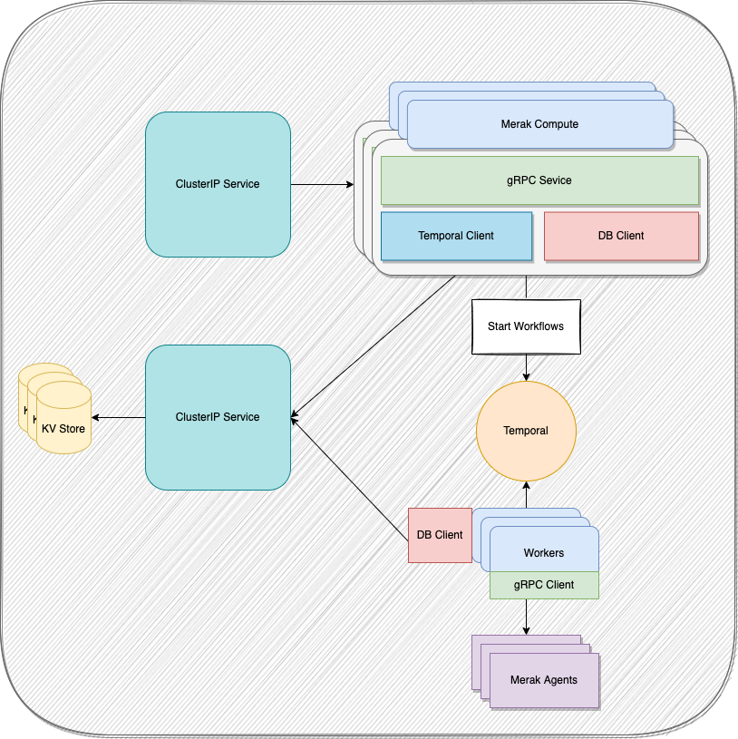
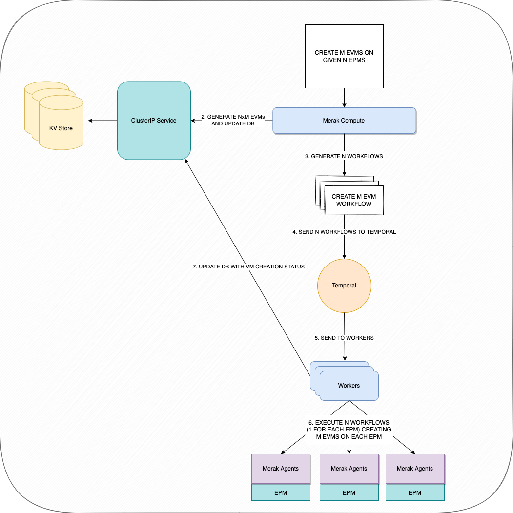

# Merak Compute

Merak compute is a distributed service that manages the allocation of virtual machines and ports. It utilizes [Temporal](https://temporal.io) to reliably and scalably allocate emulated VMs, and ports.



## Services

The following services are provided over gRPC.

Compute Scenarios:
- INFO
  - Returns information about the current status of the scheduled VMs.
- CREATE
  - Creates a new set of VMs.
- UPDATE
  - Update an existing set of VMs.
- DELETE
  - Delete an existing set of VMs.

## Components

### Merak Compute Controller
The Merak Compute Controller will be responsible for receiving, parsing, and acting on requests sent  from the scenario manager. It also be responsible for registering the various
workflows and activities with their corresponding workers.
Based on the requests, it will invoke workers via the temporal client to run the workflows.

### VM Workers
The VM Worker will be responsible for making calls to the Merak Agent to Create/Update/Delete VMs by running workflows.

#### VM Worklfows

The VM workers will be responsible for running the following workflows

- VM Create
- VM Delete
- VM Update
- VM Info


#### Merak Compute Create Workflow



Workflows for the VMCreate process are created on a per host basis and are assigned to workers by the [Temporal Cluster](https://docs.temporal.io/workers)

A single VMCreate workflow consists of three steps.

1. Establish a gRPC connection with the desired host(EPM).
2. Create the number of requested VMs(EVM) on the host(EPM).
3. Update the database on the status of each VMs(EVM) creation status.

## Scheduling

Merak Compute will assume that the Kubernetes scheduler has uniformally distributed its pods across all nodes in the cluster.

#### VM/Port Distribution

The following are the four VM and port distribution settings.

**Manual**: VMs/Ports are manually assigned to an existing port.

**Random**: Schedules VMs/Pods randomly

**Skew**: Schedule majority of VM/Pods on a small group of hosts.

**Uniform**: Schedule all VM/Pods evenly.

#### VM/Port Schedule Rate

The following are the three VM and Port scheduling settings.

**Sequential**: Each VM/Port will be created one-by-one.

**RPS**: VMs/Ports will be created at a given rate given by the Scenario Manager.

**Random**: VM/Port will be created at a random rate.

## Data Model


#### Compute Datamodel

- Pod
  - ID
  - Name
  - IP
    - VMs

- VM
  - ID
  - Name
  - Tenant
  - VPC
  - Subnet
  - Security Group
  - IP
  - Status
  - Host IP
  - Host MAC
  - Host Name
  - Gateway
  - Status


Example:
```
{
    "pod":
    {
        "id": "pod1",
        "name": "node1",
        "ip": "10.0.0.2",
        "vms": ["vm1","vm2"]
    }
}
```

```
{
  "vm":
  {
      "id": "netns1",
      "name": "vm1",
      "vpc": "1",
      "tenantID": "1",
      "subnetID": "1",
      "cidr": "10.0.0/8",
      "ip" : "10.0.0.2"
      "gw": "10.0.0.1",
      "sg": "123",
      "hostIP": "172.0.0.2",
      "hostmac": "aa:bb:cc:dd:ee:ff",
      "hostname": "pod1",
      "status": "DEPLOYED",
  }
}
```


### Data Storage
Merak Compute will use a distributed KV Datastore behind a Kubernetes ClusterIP service.
