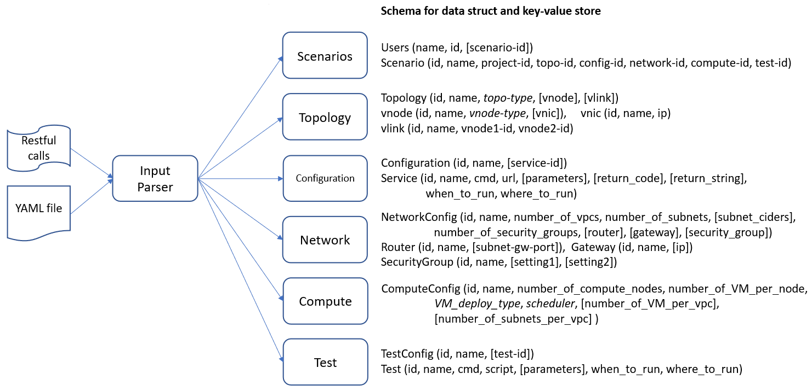
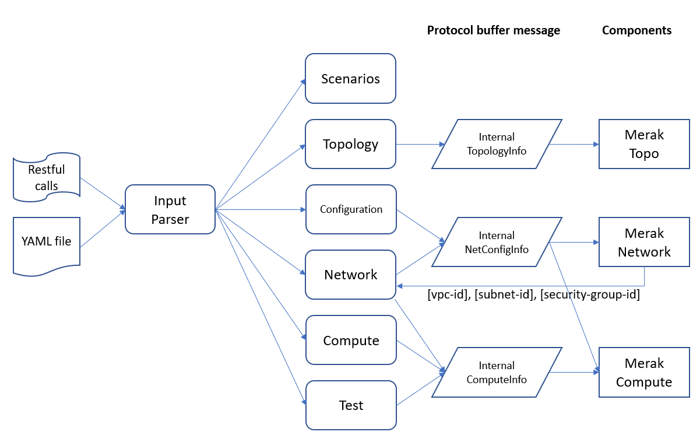

# Scenario Manager

Scenario Manager is a core component in the Merak architecture. It provides APIs for user to request emulation resources and enter necessary input through restful APIs or GUI. It will create protobuf messages according to user's input and send them to the corresponding component through gRPC communication channel.

### User Input Example
User can request emulation resources through restful APIs with Json body or through command line tool with YAML file input. The following figures show an example of user's input with Json format.

<details>
    <summary>Click to expand Service Configuration</summary>
    <h5>Service Configuration:</h5>

```
{
	"configuration": {
		"name": "configuration-1",
		"id": "",
		"service-config": {
			"name": "service-config1",
			"id": "",
			"services": [
				{
					"name": "alcor-createDefaultTable",
					"id": "",
					"cmd": "curl",
					"url": "http://10.213.43.111:30001/segments/createDefaultTable",
					"parameters": [
						"-X POST",
						"-H 'Content-Type: application/json'",
						"-H 'Accept: */*'"
					],
					"return_code": [
						"200",
						"201"
					],
					"return_string": [
						""
					],
					"when_to_run": "INIT",
					"where_to_run": "NETWORK"
				},
				{
					"name": "alcor-nodemanager",
					"id": "",
					"cmd": "curl",
					"url": "http://10.213.43.111:30007/nodes/bulk",
					"parameters": [
						"-X POST",
						"-H 'Content-Type: application/json'",
						"-H 'Accept: */*'",
						"-d '{ \"host_info\": [ { \"host_dvr_mac\": \"string\", \"local_ip\": \"string\", \"mac_address\": \"string\", \"ncm_id\": \"string\", \"ncm_uri\": \"string\", \"node_id\": \"string\", \"node_name\": \"string\", \"server_port\": 0, \"veth\": \"string\" } ]}'"
					],
					"return_code": [
						"200",
						"201"
					],
					"return_string": [
						""
					],
					"when_to_run": "AFTER:alcor-createDefaultTable",
					"where_to_run": "NETWORK"
				},
				{
					"name": "aca-cmd",
					"id": "",
					"cmd": "/root/alcor-control-agent/build/bin/AlcorControlAgent",
					"url": "",
					"parameters": [
						"-d",
						"-a 10.213.43.111",
						"-p 30014"
					],
					"return_code": [
						""
					],
					"return_string": [
						""
					],
					"when_to_run": "INIT",
					"where_to_run": "AGENT"
				}
			]
		}
    }
}
```
</details>
<details>
    <summary>Click to expand Network Configuration</summary>
    <h5>Network Configuration:</h5>

```
{
	"configuration": {
		"name": "configuration-1",
		"id": "",
		"network-config": {
			"name": "network-config1",
			"id": "",
			"number_of_vpcs": 3,
			"number_of_subnets_per_vpc": 3,
			"subnet_ciders": [
				"10.0.0.6/24",
				"10.0.0.7/24",
				"10.0.0.8/24"
			],
			"number_of_security_groups": 2,
			"routers": [
				{
					"name": "router1",
					"id": "",
					"subnets": [
						"10.0.0.6/24",
						"10.0.0.7/24"
					]
				},
				{
					"name": "router2",
					"id": "",
					"subnets": [
						"10.0.0.7/24",
						"10.0.0.8/24"
					]
				}
			],
			"gateways": [
				{
					"name": "gateway1",
					"id": "",
					"ip": "10.0.0.1"
				}
			],
			"security_groups": [
				{
					"name": "secgroup1",
					"id": "",
					"setting1": "",
					"setting2": ""
				}
			]
		}
    }
}
```
</details>
<details>
    <summary>Click to expand Topology Configuration</summary>
    <h5>Topology Configuration:</h5>

```
{
	"configuration": {
		"name": "configuration-1",
		"id": "",
		"topology": {
			"name": "topo1",
			"id": "",
			"type": "tree",
			"number_of_vhosts": 500,
			"number_of_vswitches": 11,
			"vhosts_per_switch": 50,
			"number_of_gateways": 1,
			"gateway_ips": [
				"10.0.0.1/24",
				"10.0.1.1/24"
			],
			"images": [
				{
					"name": "ovs",
					"id": "",
					"registry": "yanmo96/ovs_standard",
					"cmd": [
						"/bin/sh",
						"-c"
					],
					"args": [
						"service rsyslog restart && /etc/init.d/openvswitch-switch restart"
					]
				},
				{
					"name": "aca",
					"id": "",
					"registry": "yanmo96/aca_build_standard",
					"cmd": [
						"/bin/sh",
						"-c"
					],
					"args": [
						"service rsyslog restart && /etc/init.d/openvswitch-switch restart"
					]
				}
			],
			"vnodes": [
				{
					"name": "a1",
					"nics": [
						{
							"name": "a1-eth1",
							"ip": "172.18.0.10"
						}
					]
				},
				{
					"name": "a2",
					"nics": [
						{
							"name": "a2-eth1",
							"ip": "172.18.0.11"
						}
					]
				},
				{
					"name": "ovs1",
					"nics": [
						{
							"name": "ovs1-eth1",
							"ip": ""
						},
						{
							"name": "ovs1-eth2",
							"ip": ""
						}
					]
				}
			],
			"vlinks": [
				{
					"name": "link1",
					"from": "a1:a1-eth1",
					"to": "a2:a2-eth1"
				},
				{
					"name": "link2",
					"from": "ovs1:ovs1-eth1",
					"to": "a1:a1-eth1"
				},
				{
					"name": "link3",
					"from": "ovs1:ovs1-eth2",
					"to": "a2:a2-eth1"
				}
			]
		}
    }
}
```
</details>
<details>
    <summary>Click to expand Compute Configuration</summary>
    <h5>Compute Configuration:</h5>

```
{
	"configuration": {
		"name": "configuration-1",
		"id": "",    
		"compute-config": {
			"name": "vm-deploy1",
			"id": "",
			"number_of_compute_nodes": 200,
			"number_of_VM_per_node": 5,
			"number_of_port_per_VM": 1,
			"VM_deploy_type": "UNIFORM",
			"scheduler": "SEQUENTIAL",
			"number_of_VM_per_vpc": [
				500,
				500
			],
			"number_of_subnets_per_vpc": [
				2,
				5
			]
		}
    }
}
```
</details>
<details>
    <summary>Click to expand Test Configuration</summary>
    <h5>Test Configuration:</h5>

```
{
	"configuration": {
		"name": "configuration-1",
		"id": "",
		"test-config": {
			"name": "test1",
			"id": "",
			"test": [
				{
					"name": "pingall",
					"id": "",
					"script": "github.com/merak/test/scripts/script1.sh",
					"cmd": "ping",
					"parameters": [ "" ],
					"when_to_run": "",
					"where_to_run": ""
				}
			]
		}
	}
}
```
</details>

### Schema for Data Struct and key-value store
The following figure shows that the data flow from user's input to each process module in the Scenario Manager and the schema for data struct and key-value store.



### Protobuf message for other components
Scenario Manager is responsible to create protobuf messages according to user's input and send them to the corresponding components. The following figure shows that how scenario manager create the messages and send them to other components through gRPC communication channel.



### REST APIs
The restful APIs provided by scenario manager are for user to request emulated resources and input related configurations.

#### API Snapshot

API Name | Method | Request | Response
--- | --- | --- | ---
List Scenarios | GET | /project/{projetid}/scenarios | All scenarios' state for a user
Create a Scenario | POST | /project/{projectid}/scenarios | scenario ID
Show a Scenario | GET | /project/{projectid}/scenarios/{scenarioid} | Scenario state
Update a Scenario | PUT | /project/{projectid}/scenarios/{scenarioid} | Scenario state
Delete a Scenario | DELETE | /project/{projectid}/scenarios/{scenarioid} | Response ID
List Topology | GET | /project/{projetid}/topologies | All topologies' state
Create a Topology | POST | /project/{projectid}/topologies | topology ID
Show a Topology | GET | /project/{projectid}/topologies/{topologyid} | Topology state
Update a Topology | PUT | /project/{projectid}/topologies/{topologyid} | Topology state
Delete a Topology | DELETE | /project/{projectid}/topologies/{topologyid} | Response ID
List Service-config | GET | /project/{projetid}/service-config | All service-config state
Create a service-config | POST | /project/{projectid}/service-config | service-config-id
Show a service-config | GET | /project/{projectid}/service-config/{service-config-id} | service-config state
Update a servce-config | PUT | /project/{projectid}/service-config/{service-config-id} | service-config state
Delete a service-Config | DELETE | /project/{projectid}/service-config/{service-config-id} | Response ID
List network-config | GET | /project/{projetid}/network-config | All network-config state
Create a network-config | POST | /project/{projectid}/network-config | network-config-id
Show a network-config | GET | /project/{projectid}/network-config/{network-config} | network-config state
Update a network-config | PUT | /project/{projectid}/network-config/{network-config-id} | network-config state
Delete a network-config | DELETE | /project/{projectid}/network-config/{network-config-id} | Response ID
List compute-config | GET | /project/{projetid}/compute-config | All compute-config state
Create a compute-config | POST | /project/{projectid}/compute-config | compute-config-id
Show a compute-config | GET | /project/{projectid}/compute-config/{compute-config} | compute-config state
Update a compute-config | PUT | /project/{projectid}/compute-config/{compute-config-id} | compute-config state
Delete a compute-config | DELETE | /project/{projectid}/compute-config/{compute-config-id} | Response ID
List test-config | GET | /project/{projetid}/test-config | All test-config state
Create a test-config | POST | /project/{projectid}/test-config | test-config-id
Show a test-config | GET | /project/{projectid}/test-config/{test-config} | test-config state
Update a test-config | PUT | /project/{projectid}/test-config/{test-config-id} | test-config state
Delete a test-config | DELETE | /project/{projectid}/test-config/{test-config-id} | Response ID
