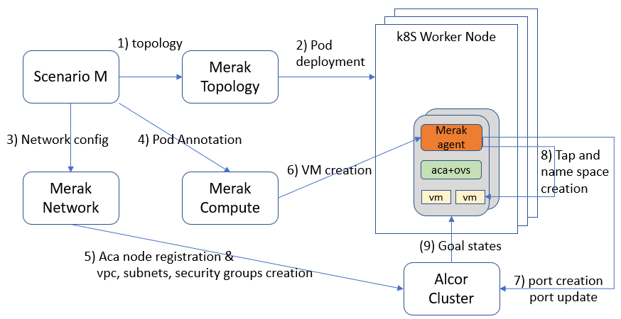

# Merak Design

### Merak Architecture

### Components
1. Scenario Manager - Create topologies and test scenarios
2. Merak Topo - Deploy pods with a given topology
3. Merak Network - Create network infrastructure resources (e.g., vpc, subnet, security group)
4. Merak Compute - Compute node registration, VM creation and test results collection from agents
5. Merak Agent - Create virtual network devices (bridges, tap devices and veth pairs) and network namespace for VMs, collect test results and send them back to Merak Compute

### Workflows

### Development Design
1. Language: Golang + Python
2. Framework: k8s + microservices
3. Communication: gRPC + Restful 
4. Persistence: key-value datastore

### Function Requrements
#### Scenario Manager
1. Parse user's input (Json from restful or Yaml from file)
2. Scenario create/update/delete
3. Save/update/delete user's input to Topology, Configuration, Network, Compute, and Test entities.
4. Construct protobuf messages for other related components.
5. gRpc to Merak topo with InternalTopologyInfo protobuf message.
6. gRpc to Merak Network with InternalNetConfigInfo protobuf message.
7. gRpc to Merak Compute with InternalComputeInfo protobuf message.

#### Merak Topo
1. Pull the test target image (ACA+OVS, Mizar)
2. Install/run Merak Agent (wget to download and install, then run) after pod deployed or during the pod deploying
3. Create grpc channel with Scenario Manager
4. Parse the protobuf message from Scenario Manager
5. Deploy/destroy the topology
6. Update the topology

#### Merak Network
1. Register/UnRegister Computer Node (ACA)
2. Create/update/delete Network Infrastructure for test target in the test scenarios
	i. Virtual networks - VPC, Subnet, security groups, router, gateway, routing rules.
	ii. Physical networks - gateway, node-level's routing rule update
	iii. Extra network devices - configuration of network device pods

#### Merak Compute
1. Issue VM create/update/delete commands to the specified Merak Agent.
2. Collect the test target (ACA), VM and Pod status from Merak Agent.
3. Maintain the communication channel with Merak Agent.
4. (optional) Install/Run the test target (other than ACA, e.g., simple binary or scripts) in each compute node.

#### Merak Agent
1. VM create/update/delete on the sequentially
2. VM create/update/delete on the concurrently with certain rps
3. Create VM as docker container (after 6/30)
4. Collect VM status
5. Collect test target status
6. Collect Test Results from each VM (e.g., ping, tcpdump, etc.)

### Protobuf Message Definition
